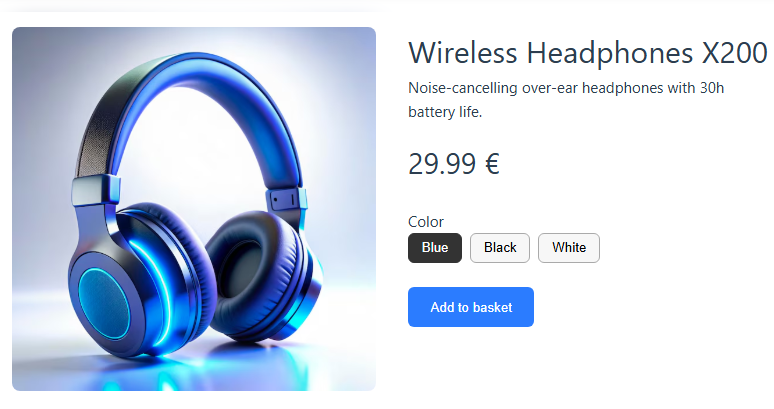
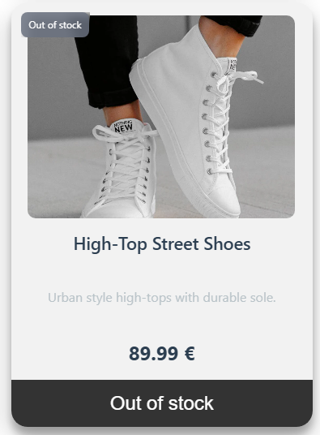
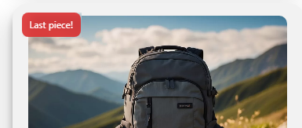
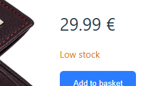
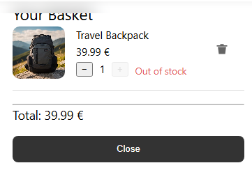
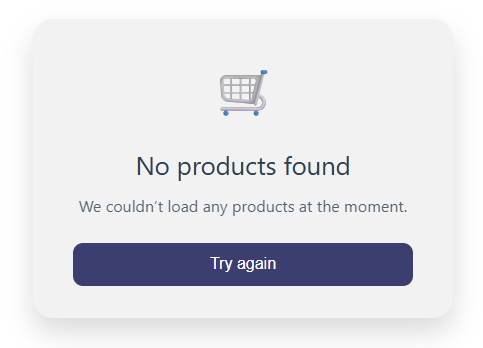
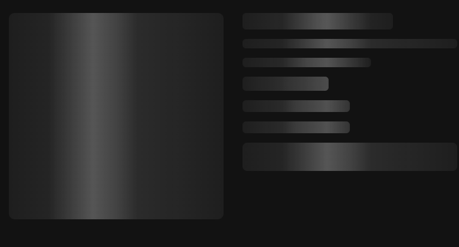
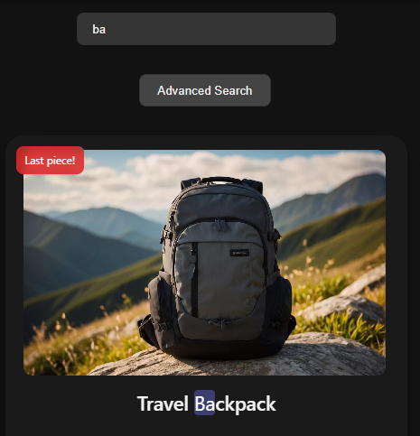

# infiterra-assignment

This project is already deployed for convenience and easy access, and it can be viewed at the following URL:

```sh
https://infiterra-grigoris.netlify.app
```

## Recommended IDE Setup

[VS Code](https://code.visualstudio.com/) + [Vue (Official)](https://marketplace.visualstudio.com/items?itemName=Vue.volar) (and disable Vetur).

## Recommended Browser Setup

- Chromium-based browsers (Chrome, Edge, Brave, etc.):
  - [Vue.js devtools](https://chromewebstore.google.com/detail/vuejs-devtools/nhdogjmejiglipccpnnnanhbledajbpd)
  - [Turn on Custom Object Formatter in Chrome DevTools](http://bit.ly/object-formatters)
- Firefox:
  - [Vue.js devtools](https://addons.mozilla.org/en-US/firefox/addon/vue-js-devtools/)
  - [Turn on Custom Object Formatter in Firefox DevTools](https://fxdx.dev/firefox-devtools-custom-object-formatters/)

## Type Support for `.vue` Imports in TS

TypeScript cannot handle type information for `.vue` imports by default, so we replace the `tsc` CLI with `vue-tsc` for type checking. In editors, we need [Volar](https://marketplace.visualstudio.com/items?itemName=Vue.volar) to make the TypeScript language service aware of `.vue` types.


## Project Setup & Installation

### 1. Clone το repository

```sh
git clone https://github.com/f-grego/infiterra--assignment.git
```
```sh
cd infiterra-assignment
```

### 2. Εγκατάσταση dependencies

```sh
npm install
```

### 3. Run Express Node Server on Port 8000

```sh
npm run start
```

#### * NOTE * ___ JSON data can be found after npm run start command

```sh
http://localhost:8000/products
http://localhost:8000/categories
```

### 4. Start the FrontEnd App local in a new terminal window

```sh
npm run dev
```

#### * NOTE * ___  Need Both commands to run the project locally


### 5. Type-Check, Compile and Minify for Production (not necessary)

```sh
npm run build
```

### 6. Run Unit Tests with [Vitest](https://vitest.dev/)

```sh
npm run test:unit
```

The project uses Vite environment variables and they are not included in .gitignore so can be found and run easily.


# Approach & Architecture

1. The project follows a component‑driven architecture, where every feature is modular and self‑contained.
2. Vite was chosen as the build tool, as it offers exceptional development speed, native ES module support, and is the officially recommended and most efficient option for modern Vue 3 applications.
3. Pinia is used for state management due to its simplicity, reactivity,TypeScript‑friendly API and as the suggested Vue State management store.
4. The Composition API is used to achieve cleaner, more reusable logic. Composables are introduced not only for this project’s needs but also to support future reusability and maintain a consistent architectural approach.
5. Core TypeScript types are defined in models/types.ts, while some additional interfaces are placed directly inside each store for convenience and readability.
6. Constants are organized in a dedicated folder, including mock data, pagination settings, and sorting options.
7. All SVG icons are stored in components/icons and referenced by name wherever needed.
8. A lightweight Node.js Express server is used to serve mocked data, simulating real API requests during development.
9. A custom logo.png is created and included in the assets folder and used throughout the UI.
10. Global CSS files ensure consistent styling and support for dark mode, but scoped styling is used as well.
11. As a general principle, the project avoids unnecessary external libraries to maintain simplicity, performance, and full control over the codebase.
12. Vitest is used for testing, as it is the most efficient and officially recommended testing framework for Vue, offering seamless integration with Vite and excellent performance.


# Challenges

Except for the time given to fulfill the assignment, one of the main challenges was deploying the project for easier demonstration and accessibility.
Since Netlify can host static sites for free, I created a separate branch that uses only mocked data without the Express server, allowing the project to be deployed successfully.

Another challenge was testing. I had never used automated tests in my professional career before, so I had to learn the basics from scratch.
I used modern resources available and documentation to reach a functional beginner/basic‑level understanding and implement meaningful tests across the project as well.

# Extra – Bonus Features Implemented

* I aimed to complete every bonus requirement included in the assignment, and beyond those, I also implemented several extra features to further enhance the project’s functionality and user experience.

⭐ Product View Page


A dedicated responsive product details page with improved UI and routing. Users can navigate to it by clicking on a product image.

⭐ Stock Logic with Informative Messages

  


The main product list displays stock badges and disables the “Add to Basket” button when necessary.



The Product View page includes additional stock messages and updates the cart accordingly.



Buttons and messages adjust dynamically based on stock availability.

⭐ Toast Notifications

A unified composable provides consistent success, error, and info messages across the app when a product is added or removed from the basket.

⭐ Product Load Failed Page



A fallback page informs the user when products cannot be fetched and provides a retry option
(This can be easily tested by stopping the Express server).

⭐ Loading Skeletons


Custom skeleton components enhance the loading experience for both the product list and product view pages.



⭐ Highlighting Search Terms



Search results visually highlight matching text for better user experience.

⭐ Dark Mode Toggle
A dark mode toggle automatically detects the user’s system theme preference and adjusts the UI accordingly.